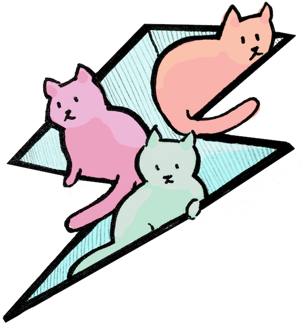

# PETS

Process for Editing Tons of Services 🐈🐈🐈

[](https://circleci.com/gh/windmilleng/pets)
[](https://godoc.org/github.com/windmilleng/pets)

Kubernetes makes it easy to manage herds of cattle: lots of servers running in
production.

`pets` makes it easy to manage herds of cats: lots of servers running on your
machine that you want to keep a close eye on for local development.



## The Big Idea

`pets` is for the cloud-service developer who has multiple servers that they run
for day-to-day feature work. Maybe the servers run as bare processes. Maybe they
run in containers. Or in minikube. Or in a remote Kubernetes cluster.

We should be able to express the constellation of servers independently of how
we start them. A `Petsfile` is like a `Makefile` for expressing how servers
start and fit together. This lets us switch back and forth quickly between
servers running locally and servers running in the cloud.

## Installation

### Binaries

You can find pre-compiled binaries for common platforms on the [releases page](https://github.com/windmilleng/pets/releases).

### From source

```
go get -u github.com/windmilleng/pets
```

## Usage

To get started using pets, read [the introductory blog post](https://medium.com/p/5f4ecba11f7d).

For more detail on how to use the CLI, you can browse the [CLI documentation](docs/pets.md).

For more detail on how to write a configuration file for your project, see the [config documentation](docs/config.md).

## Examples

We've written some example projects that use a Petsfile so start a frontend
server with two backend servers and a database:

- [Frontend Petsfile](https://github.com/windmilleng/blorg-frontend/blob/master/Petsfile)
- [Backend #1 Petsfile](https://github.com/windmilleng/blorg-backend/blob/master/Petsfile)
- [Backend #2 Petsfile](https://github.com/windmilleng/blorgly-backend/blob/master/Petsfile)

## Privacy

This tool can send usage reports to https://events.windmill.build, to help us
understand what features people use. We only report on which `pets` commands
run and how long they run for.

You can enable usage reports by running

```
pets analytics opt in
```

(and disable them by running `pets analytics opt out`.)

We do not report any personally identifiable information. We do not report any
identifiable data about your code.

We do not share this data with anyone who is not an employee of Windmill
Engineering.  Data may be sent to third-party service providers like Datadog,
but only to help us analyze the data.

## License
Copyright 2018 Windmill Engineering

Licensed under [the Apache License, Version 2.0](LICENSE)
